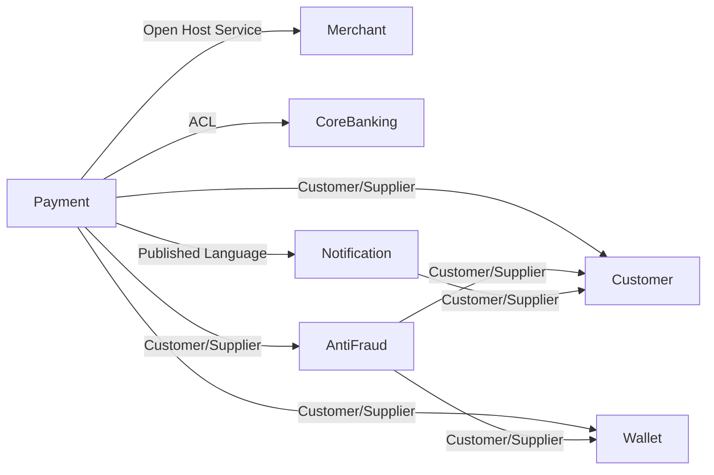

# Bounded Contexts
## Customer
Данные клиентов, договоры
## Wallet
кошельки счета балансы блокировки
## Payment
создание платежа, резервирование, списание
## CoreBanking
легаси банкинг
## Notification
нотификации (sms push email)
## AntiFraud
 антифрод, скоринг риска.
## Merchant
Интеграция с внешними системами, сервисы магазины
# Context Map

